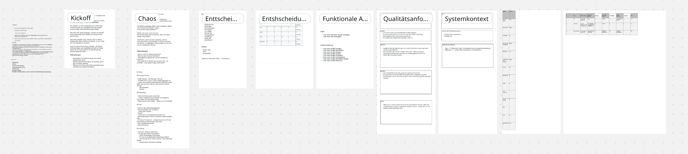

# WillLeihen - Architektur-Planspiel

**CPSA-F Lernprojekt:** Architektur "live" erleben durch rollen-basiertes Planspiel.

## Szenario
[WillLeihen](docs/12_glossary.md#willleihen) - Cross-Platform-App zum privaten Verleihen/Ausleihen von Gegenständen.

## Rollen
Jeder Teilnehmer spielte einen [Stakeholder](docs/12_glossary.md#stakeholder):

- **Architekt** - Technische Richtlinien, Architektur-Entscheidungen
- **Entwickler** - Code-Qualität, technische Umsetzbarkeit
- **Testerin** - Qualitätssicherung, Testbarkeit
- **Marketing** - Design, User Experience, schnelle Markteinführung
- **Product Owner** - Features, Timeline, Business-Anforderungen

## Dokumentation (arc42)

- [1. Einführung und Ziele](docs/01_introduction_and_goals.md) - Vision, Qualitätsziele, Stakeholder
- [2. Architekturbeschränkungen](docs/02_architecture_constraints.md) - Timeline, Budget, technische Vorgaben
- [3. Kontext und Scope](docs/03_context_and_scope.md) - Systemabgrenzung, funktionale Anforderungen
- [9. Architekturentscheidungen](docs/09_architecture_decisions.md) - ADRs mit Begründungen
- [10. Qualitätsanforderungen](docs/10_quality_requirements.md) - Messbare Qualitätsszenarien
- [11. Risiken und technische Schulden](docs/11_technical_risks.md) - Identifizierte Risiken
- [12. Glossar](docs/12_glossary.md) - Fachbegriffe und Definitionen

### Weitere Dokumentation
- [Qualitätsszenarien](docs/quality-scenarios/) - Detaillierte, messbare Szenarien
- [ADR-Details](docs/adr/) - Dokumentierte Entscheidungen

## Whiteboard

*Gemeinsam erstelltes Whiteboard aus der Zoom-Session*

➡️ [Interaktives Zoom Whiteboard](https://zoom.us/wb/doc/y0bF9NueSLeHk0ti9sbXZQ)

## Navigation

Das Repository nutzt **verlinkte Begriffe** für einfache Navigation:
- Alle [Glossar-Begriffe](docs/12_glossary.md) sind dokumentweit verlinkt
- [Qualitätsmerkmale](docs/10_quality_requirements.md) verweisen auf detaillierte Szenarien
- ADRs sind mit Begründungen und Status verknüpft

## Links

- [Blogartikel - "How to recover from Microservices"](https://world.hey.com/dhh/how-to-recover-from-microservices-ce3803cc)
- [Sammlung von Artikeln über "Majestic Monolith"](https://www.monolithic.dev/#articles)

---

*Erstellt im Rahmen des CPSA-F Kurses als Architektur-Planspiel.*